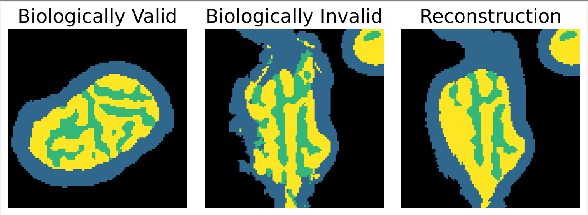

# Refining Biologically Inconsistent Segmentation Masks with Masked Autoencoders
by Alexander Sauer, Yuan Tian, Joerg Bewersdorf and Jens Rittscher

**Abstract**: Microscopy images often feature regions of low signal- to-noise ratio (SNR) which leads to a considerable amount of ambiguity in the correct corresponding segmentation. This ambiguity can introduce inconsistencies in the segmentation mask which violate known biological constraints. In this work, we present a methodology which identifies areas of low SNR and refines the segmentation masks such that they are consistent with biological structures. Low SNR regions with uncertain segmentation are detected using model ensembling and selectively restored by a masked autoencoder (MAE) which leverages information about well-imaged surrounding areas. The prior knowledge of biologically consistent segmentation masks is directly learned from the data.
We validate our approach in the context of analysing intracellular structures, specifically by refining segmentation masks of mitochondria in expansion microscopy images with a global staining.

---

This repo contains some code to reproduce the MAE we developed in our [paper](https://openaccess.thecvf.com/content/CVPR2024W/CVMI/html/Sauer_Refining_Biologically_Inconsistent_Segmentation_Masks_with_Masked_Autoencoders_CVPRW_2024_paper.html).
The main difference comparing to the original MAE is that our masking strategy is more complex: Firstly, we ignore patches that are too far from the mitochondria to prevent the model from being distracted by a large amount of background. Secondly, in the reconstruction phase, we make sure that patches with the highest amount of entropy indicted by the ensemble model are masked out.

Unfortunately, at this point, we cannot make the data with global staining for the expansion microscopy publicly  available, but you can train the method with your own data. We are very keen to learn whether it worked well for you!

